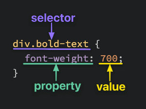

# Foundations

## Introduction

* The Odin Project is an open-source community dedicated to providing the best information sources to take you from zero to a full-stack developer
* After completing the course you will be in a position where you can simply jump straight into the documentation for anything you are trying to learn. Reading the documentation is the best way to learn any tooling
* Once you’ve completed this course, you should feel comfortable with the building blocks of web programming but itching to dig deeper. Though we spend a fair bit of time digging into each of the major topics in this course, it’s really just a taste of what comes next (and all the cool stuff you can do with it)
* The last lesson of this course will give you an opportunity to choose between a Full Stack JavaScript and Full Stack Rails path, both of which are designed to take the foundation built in this course and build it into an applied understanding of the material. Each path will focus on taking these raw building blocks and honing them into a highly functional skillset
* Tools of the trade:  
  * Computer  
  * Google  
  * Text Editor  
  * Command Line Interface (CLI)  
  * Stack Overflow  
  * Git  
  * GitHub
* Your mindset is very important when teaching yourself any new skills, not just programming. Your mindset will have more of an impact on your chances of success than just about anything else.
* Someone with the fixed mindset believes if they don’t get something on their first attempt, they never will. They believe that they aren’t smart enough to be able to do or understand some things.
* However, there is a wide body of research showing that intelligence is not fixed but can instead be developed. Someone with the growth mindset believes they can get better at anything with effort and persistence.
* What does this mean for you? It means you can learn new skills and develop new talents with persistence and grit.
* Try to work on the project consistently, even if it's a little at a time

## Prerequisites

* Installed Windows Sub-system for Linux (WSL) and installed VS Code for WSL
* Learned some command line interface (CLI) tools

## Git Basics

* I set up Git:  
* I installed it on WSL using `sudo apt-get git`  
* I then configured it with the following options:    
* `git config --global user.name "Your Name"`    
* `git config --global user.email "yourname@example.com"`    
* `git config --global init.defaultBranch main`    
* `git config --global pull.rebase false`  
* I then set up an SSH key by generating it using: `ssh-keygen -t ed25519`  
* I then navigated to `Settings > SSH and GPG keys > New SSH Key` on Github, used `cat ~/.ssh/id_ed25519.pub` to get the SSH key, and pasted it into the field and hit OK  
* I then did `ssh -T git@github.com` to test the connection, and it worked!
* Commands related to remote repository:
  * `git clone git@github.com:USER-NAME/REPOSITORY-NAME.git`
  * `git push` or `git push origin main`
* Commands related to the workflow:
  * `git add .`
  * `git commit -m "message"`
* Commands related to checking status of log history:
  * `git status`
  * `git log`

## HTML Foundations

* HTML and CSS are the two languages to create the visual aspect of websites
* HTML is the raw data a webpage is built out of, all the components it has (text, links, cards, lists, buttons, etc.)
* CSS styles these elements for aesthetic purposes
* Almost all HTML elements are pieces of content wrapped in HTML tags. Some elements are void tags, meaning they don't have a closing tag and don't contain any element, they are the element themselves

### HTML Boilerplate

* All websites should have an `index.html` file as their main page, since browsers will look for this when they open the website
* The boilerplate for a basic HTML website is:
```html
<!DOCTYPE html>
<html lang="en">
  <head>
    <meta charset="UTF-8">
    <title>My First Webpage</title>
  </head>

  <body>
  </body>
</html>
```
* Here we start with `<!DOCTYPE HTML>` which has to be on the top of all HTML documents
* We then have a head element, which contains some important information about our website
* The notes then went over the following topics (didn't feel important to take notes on):
  * Text styling (headers, bold, italics, etc.)
  * Lists
  * Links and images
* What makes a good commit? Keep it descriptive, so that a reader will know what it's about

## Intro to CSS

* The basic syntax of css is:



* So this above css would match all elements that match with this selector, which is all `div`s with the `bold-text` class

### Selectors

* `*` : Selects elements of all types
* `div` : Selects all elements of that type
* `.class` : Can be added to elements as `class="className"`
* `#id` : Similar to classes, but each element can only have 1 ID selector
* `sel1, sel2` : Can group these selectors together, the styling will affect all elements that match either of these
* `sel1.sel2` : Similar to above, but instead of only needing to match one of these, the element will need to match all of these
* `sel1 sel2` : Allows for selecting descendants, which will match elements matching `sel2` with parents that match `sel1`. There are more types of combinator selectors we'll cover later
* 
